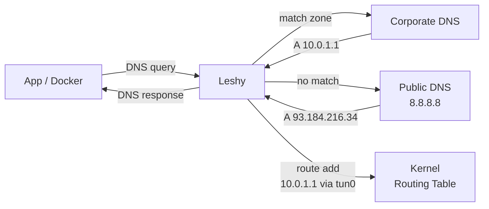
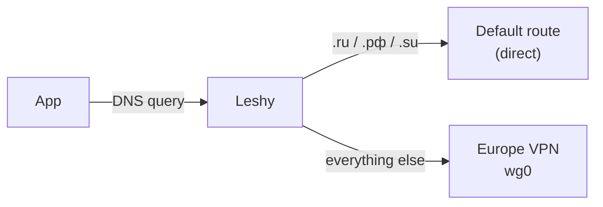
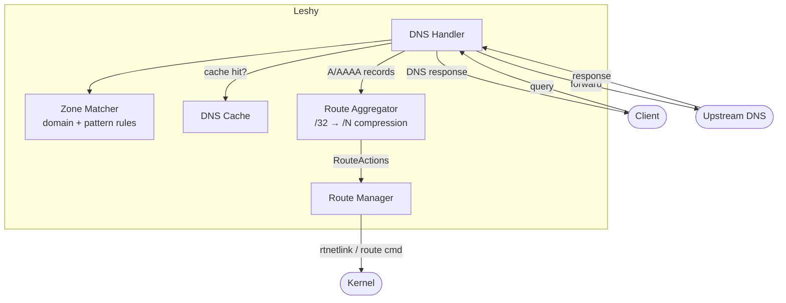

# Leshy

DNS-driven split-tunnel router. Resolves domains, installs kernel routes -- only the traffic that needs a VPN goes through a VPN. Zero manual IP management, no over-routing, no leaks. Rust, Linux + macOS + Windows.



## Quickstart

```bash
# Install
cargo install leshy

# ...or download a prebuilt binary from the Releases page
# (linux x86_64/aarch64, macOS aarch64/x86_64, Windows installer + portable zip;
#  checksums in checksums.txt)

# Write your config
sudo mkdir -p /etc/leshy
sudo vim /etc/leshy/config.toml   # see Configuration below

# Install and start as a system service (systemd / launchd)
sudo leshy service install

# Point your DNS at Leshy
echo "nameserver 127.0.0.53" | sudo tee /etc/resolv.conf
```

That's it. Leshy is running, will start on boot, and routes VPN traffic automatically.

## Configuration

```toml
[server]
listen_address = "127.0.0.53:53"
default_upstream = ["8.8.8.8:53", "8.8.4.4:53"]

[[zones]]
name = "corporate"
dns_servers = ["10.0.0.2:53"]
route_type = "dev"                       # route via VPN tunnel device
route_target = "/run/vpn/corporate.dev"  # file containing device name (e.g. "tun0")
domains = ["internal.company.com", "git.company.com"]
patterns = ["corp"]                      # regex

[[zones]]
name = "eu"
route_type = "via"              # route via static gateway
route_target = "192.168.169.1"
domains = ["example.com"]
```

See [config.example.toml](config.example.toml) for all options.

### Route Types

| Type | Target | Use case |
|------|--------|----------|
| `dev` | Path to file containing device name | VPNs that connect/disconnect (tun0, wg0) |
| `via` | Gateway IP address | Always-on VPN or static gateway |

### Domain Matching

- **`domains`** -- exact match + all subdomains (`company.com` matches `git.company.com`)
- **`patterns`** -- regex match against the queried name

## Why Leshy

Traditional split-tunnel tools like `vpn-slice` hardcode IPs in `/etc/hosts`, which breaks isolated networking (Docker builds, sandboxes). Leshy runs as a DNS server -- all apps get correct routing transparently.

## Example: Route Everything Except .ru Through a European VPN

A common setup: you have a WireGuard/OpenVPN tunnel to a European server and want **all** traffic to go through it -- except Russian domains (.ru, .рф, .su) which should go direct.



```toml
[server]
listen_address = "127.0.0.53:53"
default_upstream = ["8.8.8.8:53", "1.1.1.1:53"]

[[zones]]
name = "eu-vpn"
mode = "exclusive"              # route everything EXCEPT matched domains
dns_servers = []                # use default upstream
route_type = "dev"
route_target = "/run/vpn/eu.dev"
# These domains are EXCLUDED from the VPN (go direct):
domains = []
patterns = [
    '\.ru$',                    # *.ru
    '\.xn--p1ai$',             # *.рф (punycode)
    '\.su$',                    # *.su
]
```

Write the device file when your VPN connects (`echo wg0 > /run/vpn/eu.dev`) and every domain that isn't .ru/.рф/.su gets routed through `wg0`. Local and Russian traffic stays on your normal connection.

### IP Exclusion Ranges

In exclusive zones, `static_routes` serve a dual purpose: they define IP ranges to **exclude from routing**. When a DNS-resolved IP falls within any CIDR in `static_routes`, Leshy skips route installation entirely.

This is useful when you want most traffic through a VPN, but need certain IP ranges (like RFC1918 private networks) to go direct:

```toml
[[zones]]
name = "vpn-catchall"
mode = "exclusive"
route_type = "via"
route_target = "10.8.0.1"
domains = []       # don't exclude any domains
patterns = []      # don't exclude any patterns
static_routes = ["10.0.0.0/8", "172.16.0.0/12", "192.168.0.0/16"]
```

With this config:
- `internal.company.com` → resolves to `10.0.5.50` → **no route** (in 10.0.0.0/8)
- `printer.local` → resolves to `192.168.1.100` → **no route** (in 192.168.0.0/16)
- `example.com` → resolves to `93.184.216.34` → **route via 10.8.0.1** (not excluded)

This ensures private network traffic (home router, local printers, etc.) bypasses the VPN even when domains aren't explicitly excluded.

## Features

- **Zone-based routing** -- different DNS servers and route targets per zone
- **Hot reload** -- `auto_reload = true` watches config and applies changes live
- **Composable config** -- split zones into `config.d/*.toml` files
- **DNS caching** -- with per-zone and per-server TTL overrides
- **Route aggregation** -- compress /32 host routes into wider CIDR prefixes (`route_aggregation_prefix = 24`)
- **Static routes** -- add CIDR routes on startup (`static_routes = ["10.0.0.0/8"]`)
- **IP exclusion ranges** -- in exclusive zones, `static_routes` skip route installation for resolved IPs in those CIDRs
- **Upstream failover** -- tries DNS servers in order, falls over on failure
- **VPN reconnect** -- device file disappears/reappears as VPN disconnects/connects
- **Linux + macOS + Windows** -- rtnetlink on Linux, `/sbin/route` on macOS, IP Helper API (`CreateIpForwardEntry2`) on Windows

## Running as a Service

```bash
# Install with defaults (config: /etc/leshy/config.toml, service name: leshy)
sudo leshy service install

# Custom config path
sudo leshy service install --config /etc/leshy/corp.toml

# Multiple instances with different names
sudo leshy service install --name leshy-corp --config /etc/leshy/corp.toml
sudo leshy service install --name leshy-eu   --config /etc/leshy/eu.toml

# Remove a service
sudo leshy service uninstall
sudo leshy service uninstall --name leshy-corp
```

On Linux this creates a systemd unit with `CAP_NET_ADMIN` + `CAP_NET_BIND_SERVICE`. On macOS it creates a launchd plist with `KeepAlive` + `RunAtLoad`. On Windows it registers a Windows service (auto-start, run as LocalSystem, restart on failure) and requires an elevated prompt.

A ready-made Windows installer and portable zip are produced by
[windows/build-package.ps1](windows/README.md).

You can also run leshy directly:

```bash
sudo leshy /etc/leshy/config.toml
```

## VPN Integration

Write the tunnel device name when VPN connects:

```bash
echo "$TUNDEV" > /run/vpn/corporate.dev
```

Leshy reads this file on each DNS query. When the file disappears (VPN disconnects), route addition fails gracefully and DNS responses are still returned.

On Windows the device file contains the adapter alias as shown by
`Get-NetAdapter` (for example `AmneziaVPN`), matched case-insensitively; a bare
interface index written as decimal digits also works. See
[docs/windows.md](docs/windows.md) for the Windows-specific setup.

### Guides

- **[Windows Setup](docs/windows.md)** -- run Leshy natively on Windows: IP Helper routing, service installation, device-file naming
- **[OpenConnect (Cisco AnyConnect) Split Tunnel](docs/openconnect-split-tunnel.md)** -- connect to a Cisco VPN without it taking over your default route; Leshy routes only corporate traffic through the tunnel
- **[SSH Tunnel + tun2socks](docs/ssh-tun2socks.md)** -- turn an SSH connection into a routable tunnel device; route selected domains through a remote server without a full VPN

---

## Internals

### Architecture



### Project Structure

```
src/
  config.rs             Config parsing (TOML, zones, dns_servers)
  dns/
    handler.rs          DNS request handler, upstream forwarding
    cache.rs            DNS response cache
  routing/
    mod.rs              Route manager (add/remove routes per zone)
    aggregator.rs       CIDR route aggregation (/32 → wider prefixes)
    linux.rs            Linux rtnetlink operations
    macos.rs            macOS /sbin/route operations
    windows.rs          Windows IP Helper operations
  service/
    mod.rs              Service install entry point
    linux.rs            systemd unit installation
    macos.rs            launchd plist installation
    windows.rs          Windows service (SCM) installation
  reload.rs             Hot-reload config watcher
  zones/
    matcher.rs          Domain/pattern matching for zones
```

### Route Aggregation

When `route_aggregation_prefix` is set (e.g. `24`), instead of adding a /32 for each resolved IP, Leshy installs a wider prefix covering that IP. Future IPs in the same range and zone are no-ops. If an IP from a different zone falls into an existing aggregate, it splits into non-conflicting sub-prefixes.

### Development

```bash
make test              # fmt + clippy + unit tests
make integration-test  # Docker e2e (12 tests)
make watch             # auto-test on changes
```

## Disclaimer

This project is built strictly for **research and educational purposes**. It explores the possibilities of DNS-based dynamic routing and is **not intended for bypassing any government restrictions or censorship**. Users are solely responsible for ensuring their use complies with applicable laws and regulations.

## License

MIT
