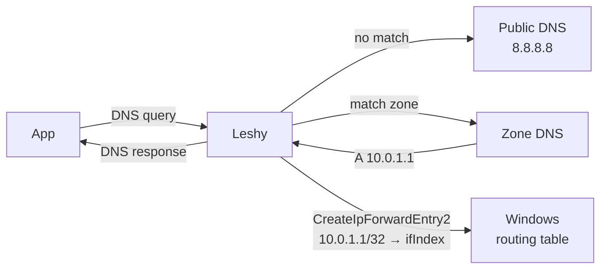

# Leshy on Windows

Leshy runs on Windows as a native binary. The DNS core (zone matching,
forwarding, caching, hot reload) is identical to Linux and macOS; only the
route installation layer and service management are platform-specific.



## Install and run

```powershell
cargo install leshy          # or build from source

# Config search order (no argument):
#   .\leshy.toml
#   .\config.toml
#   C:\ProgramData\leshy\config.toml      (service default)
#   %APPDATA%\leshy\config.toml

leshy C:\ProgramData\leshy\config.toml
leshy service install        # register the Windows service (elevated prompt)
leshy service uninstall
```

The service is created with `ServiceStartType::AutoStart`, runs as
LocalSystem (which holds the right to modify the routing table), and restarts
5 seconds after a failure via `SERVICE_CONFIG_FAILURE_ACTIONS` — the Windows
equivalent of the Linux unit's `Restart=on-failure` / `RestartSec=5s`.

## Route installation

Routes are installed through the IP Helper API (`iphlpapi.dll`), not by
shelling out to `route.exe`:

- `route_type = "dev"` — the device file contains an adapter alias (for
  example `AmneziaVPN`), resolved to an interface index through
  `ConvertInterfaceAliasToLuid` + `ConvertInterfaceLuidToIndex`, with a
  case-insensitive `GetAdaptersAddresses` scan as fallback. A bare decimal
  interface index is also accepted. The route is created on-link
  (`NextHop = 0`).
- `route_type = "via"` — the gateway interface is resolved with
  `GetBestInterface` / `GetBestInterfaceEx`, then the route is created with
  the gateway as next hop.
- Routes are static `MIB_IPPROTO_NETMGMT` entries with infinite lifetime
  (`route add -p` semantics). Re-adding an existing route and removing a
  missing one are both treated as success, matching the Linux/macOS adders.
- Removal scans `GetIpForwardTable2` for rows matching the destination prefix
  and deletes each match, so `remove_route` does not need to know the original
  gateway or interface.

Route installation requires elevation. A non-elevated Leshy still serves DNS;
combined with `route_failure_mode = "fallback"` (the default) it answers
queries and only logs the failed route additions.

## Device file contract

Same contract as Linux/macOS, adapted to Windows naming:

```text
C:\ProgramData\leshy\corporate.dev
---------------------------------
AmneziaVPN
```

The orchestrator (for example Kikimora) writes the adapter alias when the VPN
connects and deletes the file when it disconnects. Leshy reads the file on
every route addition, so a reconnect is picked up without a restart.

## Differences from Linux/macOS

| Aspect | Linux | macOS | Windows |
|--------|-------|-------|---------|
| Route API | rtnetlink | `/sbin/route` | IP Helper (`CreateIpForwardEntry2`) |
| Device name | `tun0`, `wg0` | `utun3` | adapter alias (`AmneziaVPN`, `Wi-Fi 2`) |
| Service | systemd unit | launchd plist | Windows service (SCM) |
| Default config | `/etc/leshy/config.toml` | `/etc/leshy/config.toml` | `C:\ProgramData\leshy\config.toml` |
| Privileges | `CAP_NET_ADMIN` | root | elevated / LocalSystem |

## Integration test scope

`cargo test` runs natively on Windows and covers the pure Windows helpers
(SOCKADDR conversions, network byte order, interface-name resolution against
the live OS). The route system calls themselves require elevation and are
validated by the Docker e2e suite on Linux plus manual smoke tests on Windows;
the `AGENTS.md` integration test gate applies to Linux/macOS deployments.
